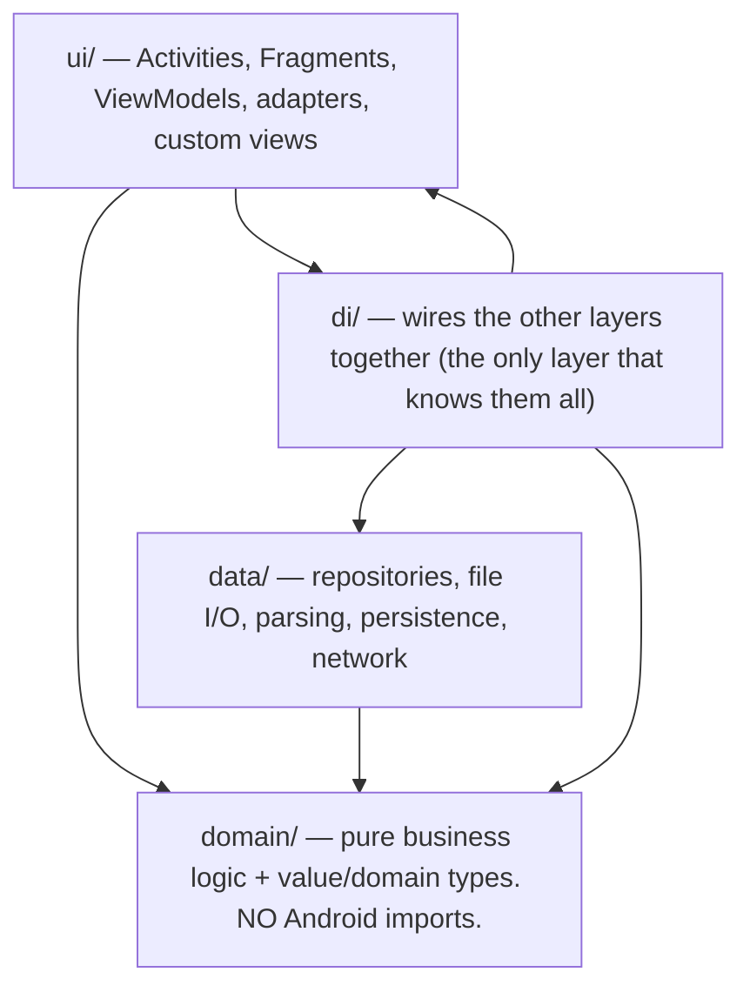

# Architecture & Layering (plugin-examples)

This is this repo's guide to how we structure code: how a module's code is split into layers,
which way dependencies are allowed to point, and a practical checklist for keeping each class
focused. `REVIEW.md`'s structure/SRP gate points here, so this is the single source of truth —
read it when designing or reviewing code.

These are **conventions upheld by review, not rules enforced by tooling.** There is no linter
or CI check that fails a build for breaking them. Apply them when you design code and check
them again when you review it. A passing build tells you the code compiles — not that it is
structured well.

## What "layering" means

Layering is the practice of splitting code into groups (layers) by *what kind of work each
group does*, and then restricting which layers are allowed to call which. The goal is to keep
**pure logic** — code that just computes results from inputs — separate from **Android/UI
code** — code that draws screens, handles taps, and talks to the operating system.

Why bother? Pure logic separated from Android is **unit-testable on a normal JVM**: you can run
it in a fast test without an Android device or emulator. (For context, Android UI classes
normally need either a device or a tool like *Robolectric*, which simulates Android in a test —
both are slower and more fragile than a plain JVM test.) Separation also limits how far a bug or
a change can spread, which the rest of this doc returns to repeatedly.

Layering applies at two scales: **within a single module**, and **across modules**.

## Layering within a module: `data/ · domain/ · ui/ · di/`

Inside a module, code is split into four packages. The diagram shows what each holds and which
packages may depend on which (an arrow means "may use / call into"):

- **`domain/`** is the foundation. It is pure Kotlin — no `android.*` or `androidx.*` imports,
  no `Context` (the Android object that gives access to system services and resources). It holds
  *value types* and *domain models* (plain data classes describing the concepts the app works
  with) and the business logic that operates on them. Because it touches no Android, it is the
  most easily unit-tested layer.
- **`data/`** does input/output: *repositories* (classes that fetch and store data behind a
  clean interface), file access, parsing, saving/loading, and network calls. It depends *down*
  on `domain/` (it produces and consumes domain types) and never *up* on `ui/`.
- **`ui/`** is everything the user sees and touches: Activities and Fragments (Android's screen
  and screen-section classes), *ViewModels* (classes that hold screen state and survive rotation),
  list adapters, and custom views. It depends down on `domain/`, and through `di/` on `data/`.
  Nothing depends on `ui/`.
- **`di/`** is the *dependency-injection* / wiring layer — the code that constructs objects and
  hands each one the collaborators it needs (whether via a framework like Hilt or done by hand).
  It is allowed to know all three other layers because composing them is its entire job.

## Layering across modules: the api/impl split

At the larger scale, a *module* is a separately-built unit of code with its own dependencies.
A feature is often split into two modules:

- An **api module** — the stable *contract*: the interfaces and value types that describe what
  the feature offers, with no implementation detail. Example: `editor-api`.
- An **impl module** — the actual implementation behind that contract. Example: `editor`.

Other code depends on the **api** module only; just the single top-level assembly point (the
"composition root" — the place where the whole app is wired together) depends on the **impl**.
This means a change inside `editor` can't ripple out to everything that uses the editor, because
those callers only ever saw `editor-api`.

### `compileOnly` and the plugin contract

Plugins push this idea further. A plugin depends on the host's `plugin-api` module as a
**`compileOnly`** dependency. `compileOnly` is a Gradle dependency scope meaning "I need this to
*compile* against, but do **not** bundle it into my output — the runtime environment already
provides it." So a plugin compiles against the host's API but ships without a copy of it; the
host supplies the real classes at load time, and the host owns and versions that API.

### Plugins are single-module — skip the api/impl split

A single-module plugin has nowhere to put a separate api module, so the api/impl split does not
apply to plugins. For a plugin, only the in-module `data/domain/ui` layering applies. Don't
create extra modules just to imitate the split.

## The dependency-direction rule

> **Dependencies flow *down* toward `domain/`. `domain/` depends on nothing above it. No layer
> ever depends "up" into `ui/`.**

"Dependency direction" just means which way the `import`/call arrows point. "Down" means toward
`domain/`; "up" means toward `ui/`. Concretely:

- **Domain/value types live in `domain/`, not in a `ui/` package.** Don't define a data type in,
  say, a `wizard/` UI package just because the wizard is the first thing that happens to use it.
- **Pure logic lives in `domain/`** so it can be unit-tested on a JVM without an Android `Context`.
- **No dependency cycles between packages or modules.** A cycle (A depends on B, and B depends
  back on A) almost always means a shared type is sitting in the wrong layer. Pull it down into
  `domain/`, and both sides can depend on it instead of on each other.

## Keep the blast radius small

"Blast radius" is how much of the system a single change or bug can affect. The guiding
principle: **keep it small.** A change should touch as few things as possible, and a bug in one
place should not be able to break unrelated code.

Layering is the *mechanism* for a small blast radius. Pure logic isolated in `domain/` can't
break the UI; swapping a repository in `data/` can't ripple into business rules; a `compileOnly`
plugin contract stops a plugin from reaching into the host's internals. When you make a
structural decision, ask: "if this turns out to be wrong, what's the blast radius?" — and prefer
the shape that contains it.

## Don't over-apply layering to a small plugin

"Clean Architecture" is the broader school of thought these layers come from; its full form
involves many packages and interfaces. Don't impose all of that on a small plugin.

The `data/domain/ui` split earns its keep once a plugin has real logic worth isolating — a
parser, a state machine, a code generator. A tiny plugin with one Fragment and no business logic
does **not** need three packages and a wiring layer. Apply layering in proportion to the logic
that actually exists. Reference plugins especially should stay minimal and clear, since other
authors learn from them.

## SRP — keeping each class focused

The **Single Responsibility Principle (SRP)** says a class should have one job — one reason to
change. "One job" is fuzzy, so instead of debating it abstractly, judge it with four concrete
checks:

1. **UI vs. logic separation.** A Fragment or Activity should *only* handle Android lifecycle,
   wiring up views, and routing user input. The moment it **formats data, makes a business
   decision, or directly does file I/O or network calls**, it has taken on logic that belongs in
   a **ViewModel** or a **domain class / use-case**. (This is also why I/O doesn't belong in a
   Fragment in the first place — it should run off the main thread, in a lower layer.)
2. **The "and" test.** If you can't describe the class without saying **"and"** — "it picks a
   bounding box *and* formats the coordinates *and* saves them" — it is holding too many jobs.
3. **Dependency bloat.** If a class or ViewModel needs **more than ~4–5 injected repositories or
   services**, it is orchestrating too much. Split it into focused use-cases.
4. **Line count (soft signal).** Not a hard limit, but a file past **~300–400 lines** is a strong
   hint that responsibilities are piling up. Go look.

When a check fires, here's how to decide whether to actually split:

- **Split when** the parts **change for different reasons** *and* **at least one part is
  independently testable** (pure logic, no `Context`).
- **Naming test:** if you can't name the piece you'd extract without using "and," or the best
  name you can think of is a vague `Manager` / `Helper` / `Util`, the seam isn't real yet — leave
  it.
- **Don't split a cohesive class just because it's long.** A self-contained algorithm, or a custom
  `View`'s drawing code, is *one* responsibility even past 500 lines.

### Wizards and other multi-step flows

For a multi-step flow (a setup wizard, a checkout sequence), prefer **one small Fragment or view
per step, all coordinated by a single shared ViewModel or state machine** that owns the overall
state and transitions. Avoid one big host Fragment that holds every step's state and all the
transition logic — that's an SRP violation by construction.

## The coupling & cohesion / layering audit

Run these five questions at **design time** (does the plan put each piece in the right layer?)
and again at **review time** (did the implementation drift from the plan?):

1. **Is the same behavior/logic duplicated across more than one module?** Copy-pasted helpers, a
   shared mutable contract, the same rule implemented twice — give it one home.
2. **Are there dependency cycles, or low-level code depending "up" into UI?**
3. **Is any module or Fragment a "god object"** doing I/O *and* orchestration *and* UI in one
   class?
4. **Are domain/value types living in UI packages** instead of in `domain/`?
5. **Is pure logic separated from Android/UI** so it can be unit-tested on a JVM without a
   `Context`?

## Code-documentation conventions

A **strong de-facto convention upheld by review, not a hard gate** — CI won't fail a build for a
missing doc comment, but reviewers expect these:

- **KDoc on classes and non-trivial functions.** KDoc is Kotlin's documentation-comment format
  (`/** … */`, the Kotlin equivalent of Javadoc). Lead with a one-sentence summary, then add
  `@param`/`@return` lines only where they aren't obvious. Skip doc comments on trivial
  pass-throughs and self-explanatory one-liners. Document the *why* and the non-obvious, not the
  restating of an obvious signature.
- **Formatting:** use `ktfmt` (Google style) for Kotlin and `google-java-format` (Google style)
  for Java, both with **2-space indentation**. These are auto-formatters; run them rather than
  hand-formatting.
- **No GPL `@author` header in plugin files.** CoGo (the host IDE) descends from the AndroidIDE
  project and inherits its GPL license header, including an `@author` tag, on many files. Plugins
  are **not** GPL-licensed and must **not** carry that header. Don't copy it into a plugin file
  just because a CoGo file you borrowed from has it.
