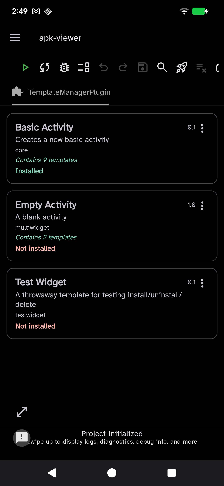
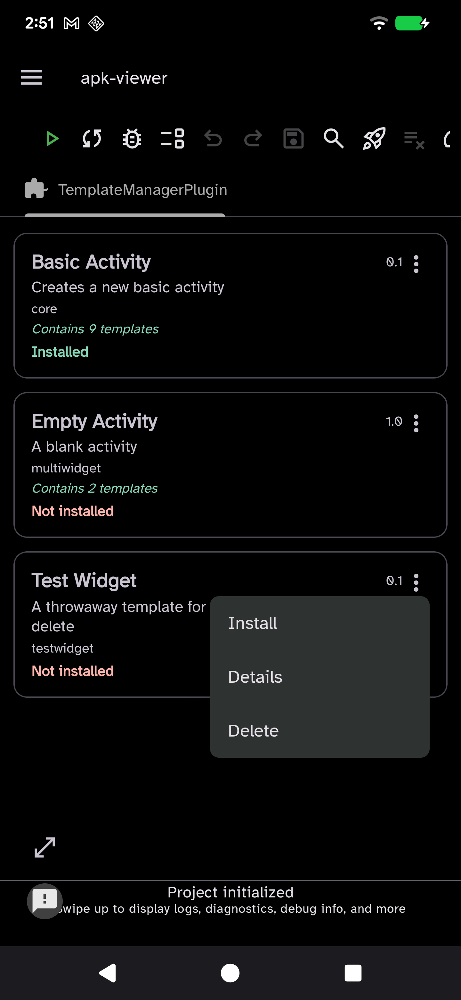
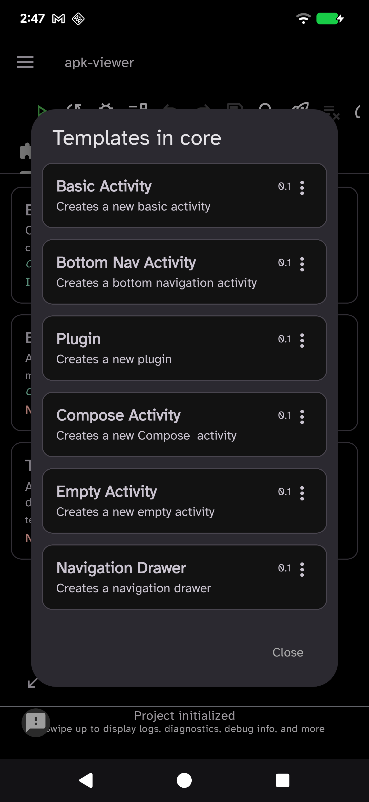
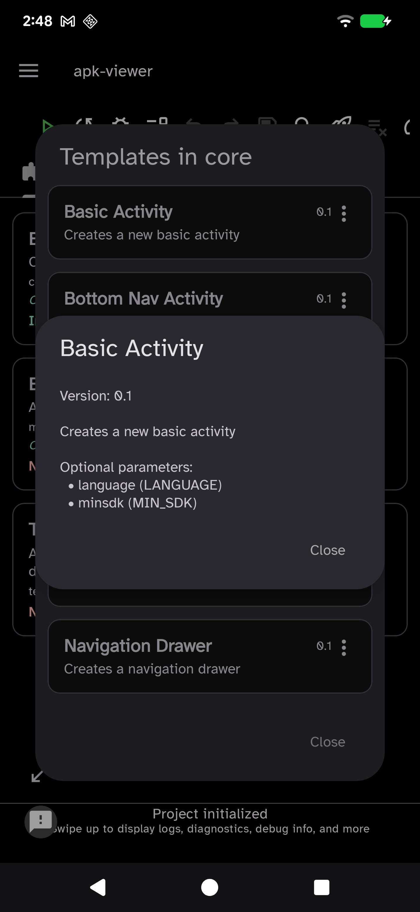

# Template Manager

A [Code On The Go](https://github.com/appdevforall/CodeOnTheGo) IDE plugin for
managing `.cgt` project/file templates directly on-device — browse installed
templates, install new ones from your Downloads folder, and uninstall or delete them,
all from a single screen inside the IDE.

## What it does

The plugin adds a **Template Manager** entry to the IDE's left sidebar (and a
matching editor tab) that shows a card list of every `.cgt` template it can find:

- **Installed templates** — every `.cgt` registered in the IDE's template store
  (`$IDE_HOME/templates`), shown with a green **Installed** status. These are the
  templates that appear in the IDE's *New Project* / *New File* wizard.
- **Available templates** — every `.cgt` sitting in `/sdcard/Download`, shown with a
  red **Not installed** status, ready to be installed.

Each card is titled with the `.cgt` file's own name and shows its version and status; a
single-template file also shows its description. A `.cgt` file can bundle more than one
template (the IDE's own `core.cgt` bundles nine); when it does, the card shows a
**"Contains N templates"** indicator instead of a description, and tapping the card (or
its **View templates** menu entry) opens a sub-screen with one card per bundled
template — each with its own **Details** action.

## Per-card actions

Each card has an overflow (⋮) menu:

| Card state | Single-template | Multi-template |
|---|---|---|
| Installed | **Uninstall**, **Details** | **Uninstall**, **View templates** |
| Not installed (in Downloads) | **Install**, **Details**, **Delete** | **Install**, **View templates**, **Delete** |

- **Install** — registers the template with the IDE and **moves** the file out of
  Downloads into the template store (it no longer appears as a Downloads entry).
- **Uninstall** — unregisters the template and **moves** it back to Downloads under its
  original filename, where it reappears as *Not installed*.
- **Delete** — permanently removes the `.cgt` from Downloads, after a confirmation
  dialog.
- **Details** — shows a single template's metadata (version, description, and any
  optional wizard parameters declared under `parameters.optional`); scrollable.
- **View templates** — for a multi-template `.cgt`, opens the per-template card
  sub-screen described above; each of those cards has its own **Details**.

Install / Uninstall / Delete always operate on the whole `.cgt` file, since that's the
unit the IDE registers.

## Screenshots

<table>
  <tr>
    <td align="center" width="50%">
      <br>
      <sub>Template list — installed (green) and available (red) cards, with a
      "Contains N templates" indicator for multi-template files.</sub>
    </td>
    <td align="center" width="50%">
      <br>
      <sub>Per-file ⋮ menu — Install / Details / Delete for a Downloads file.</sub>
    </td>
  </tr>
  <tr>
    <td align="center" width="50%">
      <br>
      <sub>Opening a multi-template <code>.cgt</code> shows one card per bundled
      template, each with its own ⋮ → Details.</sub>
    </td>
    <td align="center" width="50%">
      <br>
      <sub>A template's Details — version, description, and the optional wizard
      parameters declared under <code>parameters.optional</code>.</sub>
    </td>
  </tr>
</table>

## Building

Requires the shared Code On The Go jars at the repo root (`../libs/plugin-api.jar`,
`../libs/gradle-plugin.jar`) and the `com.itsaky.androidide.plugins.build` Gradle
plugin. Build from this folder with the repo-root Gradle wrapper.

```bash
./gradlew assemblePluginDebug     # build/plugin/templatemanagerplugin-debug.cgp
./gradlew assemblePlugin          # build/plugin/templatemanagerplugin.cgp  (release)
```

## Installing

1. Build the `.cgp` (see above) and copy it to the device (e.g. into `Download/`) from
   `build/plugin/`.
2. In Code On The Go, open **Settings → Plugin Manager**.
3. Tap the **+** button, pick the `.cgp` file, and confirm.
4. Restart the IDE when prompted.

The plugin then appears in the left sidebar.

> **Upgrading an already-installed copy?** Code On The Go compares the `.cgp`'s
> signing certificate against the installed one and refuses the install if they
> differ, showing *"…was installed from a different build variant. Uninstall it
> before installing this version."* Despite the wording, this is a **signature
> mismatch** — release builds here aren't signed with a stable key, so it triggers on
> essentially every rebuild, as well as when switching between debug and release.
> (Debug rebuilds on the same machine share the debug keystore, so those can be
> replaced in place.) When you hit it, **uninstall** the existing plugin first
> (its ⋮ menu → Uninstall), restart, then install the new `.cgp`.

## Plugin manifest

| Field | Value |
|---|---|
| `plugin.id` | `org.appdevforall.templatemanagerplugin` |
| `plugin.main_class` | `org.appdevforall.templatemanagerplugin.TemplateManagerPlugin` |
| `plugin.permissions` | `filesystem.read,filesystem.write` |
| `plugin.min_ide_version` | `26.29` |
| `plugin.max_ide_version` | `26.30` |

Two permissions are requested, both used on live code paths: `filesystem.read` to list and
parse `.cgt` files in Downloads and the template store, and `filesystem.write` to register /
unregister templates (via `IdeTemplateService`) and move / delete `.cgt` files. No network,
system-command, or native-code access is requested.

## Project layout

```
src/main/
├── kotlin/org/appdevforall/templatemanagerplugin/
│   ├── TemplateManagerPlugin.kt              # IPlugin + UIExtension + EditorTabExtension + DocumentationExtension
│   ├── fragments/TemplateManagerPluginFragment.kt  # the template dashboard UI + install/uninstall/delete logic
│   ├── adapters/CgtFileAdapter.kt            # main list adapter + per-file overflow menu
│   ├── adapters/TemplateCardAdapter.kt       # per-template cards for the multi-template sub-screen
│   └── models/CgtFileItem.kt                 # card model + TemplateMetadata
├── res/                                       # layouts, PluginTheme, day/night colors, drawables
├── assets/                                    # icon_day.png / icon_night.png (plugin manager icons)
└── AndroidManifest.xml                        # plugin.* metadata
```
